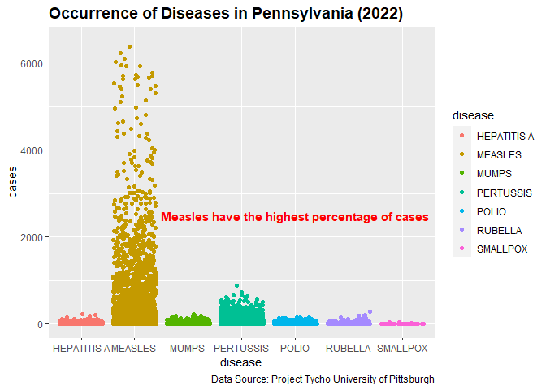

Diseases in Pennsylvania 2022
================
Todd Frazer
2023-12-01

### This Data is from ‘project_tycho_reports’ on SQL. It is authenticated by the University of Pittsburgh. This data shows the number of qualifying diseases during the year of 2022 in the state of Pennsylvania. We have imported the data set from SQL into a spreadsheet. From there the data was cleaned, analyzed, and visualized below.

``` r
library(ggplot2)
Disease_Pav1 <- read.csv("C:/Users/toddf/Desktop/Google Data Analytics/Occurence_of_Diseases_in_Pennsylvania_2022/Disease_Data_clean.csv")
str(Disease_Pav1)
```

    ## 'data.frame':    9199 obs. of  4 variables:
    ##  $ state               : chr  "PA" "PA" "PA" "PA" ...
    ##  $ disease             : chr  "HEPATITIS A" "HEPATITIS A" "HEPATITIS A" "HEPATITIS A" ...
    ##  $ cases               : int  1 1 1 1 1 1 1 1 1 1 ...
    ##  $ incidence_per_100000: num  0.01 0.01 0.01 0.01 0.01 ...

### Below we can see that Measles have the highest percentage of cases of the criteria of diseases. Pertussis, a highly contagious respiratory tract infection, is the 2nd most occurring of the diseases.

<!-- -->
